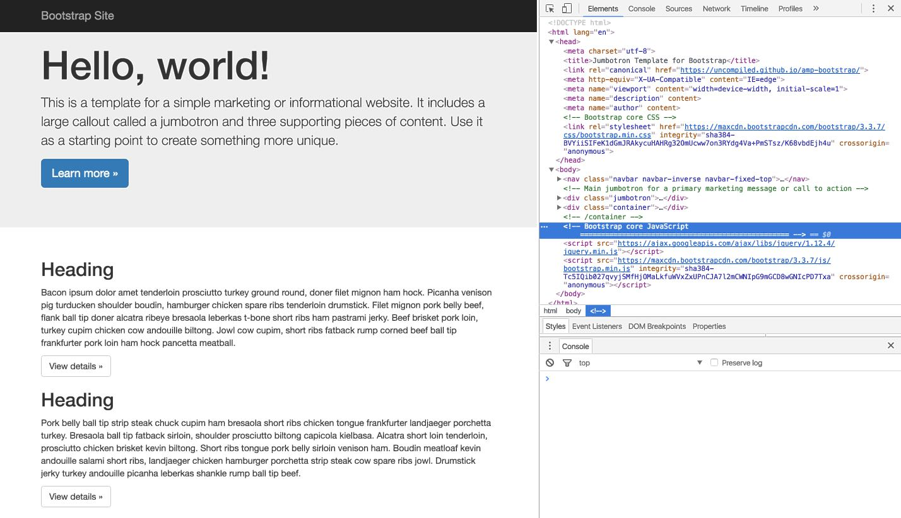
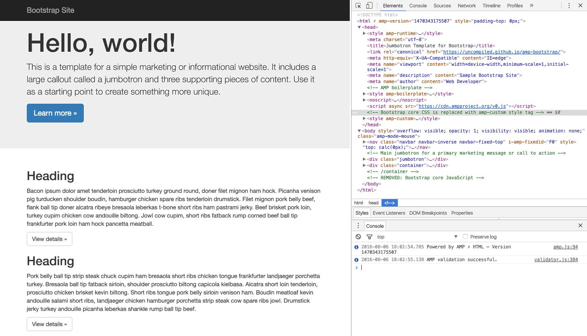

# AMP + Bootstrap Example

This is an example of building [AMP HTML](https://www.ampproject.org/) pages
from [Bootstrap](http://getbootstrap.com/)-based websites.

One of the fundamental differences between standard HTML and AMP HTML is that
AMP restricts features which can cause negative performance.  However,
those restrictions also allow the AMP format to guarantee a baseline for 
performance.

## Bootstrap-related Restrictions

- **No custom JS** means that you will not be able to include Bootstrap's JS or
  jQuery within your pages.
- **Inline CSS** means that your asset pipeline should generate your CSS and
  include it within the body of your HTML. This prevents
  [CSSOM](https://www.w3.org/TR/cssom-1/) construction from blocking rendering.
  With linked stylesheets, users incur a network penalty to retrieve styles, so
  inline CSS allows rendering to begin on the first request.
- **50kb size limitation on CSS** means that developers can't simply copy/paste
  the Bootstrap CSS into a `<style>` tag.  The minified Bootstrap CSS is 120kb,
  so that means that we will need to remove unused CSS styles.

# Samples

In this repo, there are two samples of the same website.

- `html` contains a boilerplate Bootstrap page
- `amphtml` contains an AMP version of the Bootstrap page

The final product is in the `build` folder.

# Workflow

We will focus on cleaning the CSS, leaving the minimum classes required to
maintain compatibility with Bootstrap markup. The process of cleaning unused
CSS is not specific to Bootstrap or AMP and can be used with any web development
asset pipeline, including [Rails](http://guides.rubyonrails.org/asset_pipeline.html)
or [Django](https://django-pipeline.readthedocs.io/en/latest/).

## Step 1: Create the AMP HTML

Starting with the Bootstrap version of your page, follow the AMP project
[documentation](https://www.ampproject.org/docs/get_started/create/basic_markup.html)
to make sure that the AMP version of your page contains the required markup.

## Step 2: Remove JS

From the [AMP HTML spec](https://github.com/ampproject/amphtml/blob/master/spec/amp-html-format.md):

> While it does allow styling the document using custom CSS, it
> does not allow author written JavaScript beyond what is provided
> through the custom elements to reach its performance goals.

This means you'll need to remove Bootstrap's JS and jQuery from the AMP
version of your page.

If your pages require custom JS, look at implementing
[Progressive Web App](https://developers.google.com/web/progressive-web-apps/)
techniques to supercharge your client-side performance.

## Step 3: Remove externally linked CSS

AMP pages do not allow external stylesheets, so remove the Bootstrap CSS from
the AMP version of your page.

Note that in this example, the AMP version of the HTML includes 
[html-replace](https://www.npmjs.com/package/gulp-html-replace) markup to
allow build-time replacement of the processed CSS:

```
<!-- build:cssInline -->
<!-- endbuild -->
```

## Step 4: Generate clean CSS

For this example, we'll use [Gulp](http://gulpjs.com/) with a few helpers:

- [purifycss](https://github.com/purifycss/purifycss) removes unused CSS classes
- [clean-css](https://github.com/jakubpawlowicz/clean-css) minifies the results
- [gulp-html-replace](https://github.com/VFK/gulp-html-replace) inserts the CSS into the HTML
- [amphtml-validator](https://github.com/ampproject/amphtml/tree/master/validator/nodejs) validates the output

To recreate this:

- `npm install` to fetch dependencies
- `gulp purify` to output the purified CSS in `amphtml/css`
- `gulp inline-css` to insert the CSS into the HTML in `build/index.html`
- `gulp validate` to run the AMP validator on the output file

### Handling CSS errors

AMP [disallows specific styles](https://www.ampproject.org/docs/guides/responsive/style_pages.html)
from being used, so we will run amphtml-validator to find potential
problems in the source CSS.  In this case, Bootstrap's CSS.

**Examples of CSS Restrictions:**

- Inline style attributes in your HTML
- `<link rel="stylesheet">`
- `!important`
- `*`, `:not()`
- `behavior`, `-moz-binding`

Validation is an important part of the build process because we need to ensure
that our CSS creates the desired layout and styling while also adhering to the
AMP spec.

Bootstrap uses some CSS styles that are not allowed in AMP:

- CSS syntax error in tag 'style amp-custom' - saw invalid at rule '@-ms-viewport'
- The text (CDATA) inside tag 'style amp-custom' contains 'CSS !important', which is disallowed

# Results

Once the unused (and invalid) classes are stripped from the original Bootstrap
CSS, the minified output shrinks from 120kb down to 12kb.

### Before



### After



The pages should look exactly the same.
